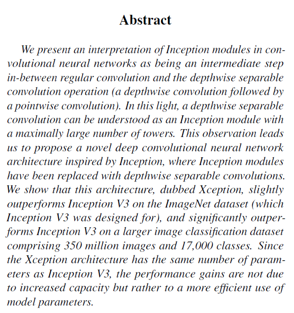
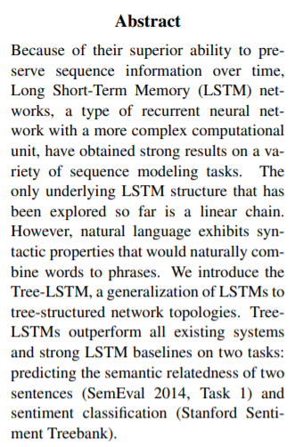

# 1 Introduction

由于深度学习的迅速发展，现在基于传统的RNNs、CNN、FFNN、attention的工作效果，基于经典模型的本身的改进在顶会中竞争能力可能不再powerful。本项工作致力于搜集各种`高被引`的`基于经典深度学习神经网络的变种神经网络的论文及其代码实现`以供对深度学习技术感兴趣的同学进行学习，文档持续更新完善。

Hello, everyone! I am Ruifeng Tan, the maintainer of this repository whose interest is in deep learning, especially its application in NLP and KBQA task. This repository is aimed at collecting powerful neural networks which is proposed by high cited paper and their code (we firstly make sure the paper have Pytorch implement and secondly Tensorflow)

# 2 Contents

1. [2017NIPS_attention is all you need](https://arxiv.org/abs/1706.03762) **cited by 17156+**
2. [2016CVPR_Xception: Deep Learning with Depthwise Separable Convolutions](https://arxiv.org/abs/1610.02357) **cited by 4307+**
3. [2015ACL_Improved semantic representations from tree-structured long short-term memory networks](https://arxiv.org/abs/1503.00075) **cited by 2341+**
4. waiting for more collections. If you have any recommendation, feel free to contact me at 824449964@qq.com, but make sure that that kind of neural network variant is cited more than 100. 

# 3 Simple conclusions of each paper

I draw a simple conclusion on each paper included in this repository. If I haven't managed to conclude a paper, I would give a screenshot of its abstract for reading.

Note that, the conclusion drew by me may miss some points you're interested in. It just offer some guidance.

## 1 2017NIPS_attention is all you need

- This paper proposed a new seq2seq architecture called Transformer.
- Its idea about Multihead-attention is very cool and has been widely applied.

[pytorch code here](https://github.com/jadore801120/attention-is-all-you-need-pytorch)

[tensorflow code here](https://github.com/Kyubyong/transformer)

[If you are only interested in the multihead-attention part, get the code here](./attention_is_all_you_need)

## 2 2016CVPR_Xception: Deep Learning with Depthwise Separable Convolutions

- You can find a depthwise convolution followed by a pointwise convolution CNN in this paper.

[Pytorch code here 1](https://github.com/tstandley/Xception-PyTorch)

[Pytorch code here 2](./Xception)

[Tensorflow code here](https://github.com/kwotsin/TensorFlow-Xception)

## 3 2015ACL_Improved semantic representations from tree-structured long short-term memory networks

[Pytorch code here 1](https://github.com/dasguptar/treelstm.pytorch)

[Pytorch code here 2: not pure python](https://github.com/stanfordnlp/treelstm)

[Tensorflow code here: not found yet]()

> Some codes in this repository is copied from or slightly changed bases on:
>
> https://github.com/tstandley/Xception-PyTorch