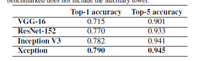

# README

# 1 Before reading code

## 1.1 key concept

- depthwise separable convolution: a depthwise convolution followed by a pointwise convolution

- inception module:  the idea behind it is to make convolution task easier and more efficient by **explicitly factoring it into a series of operations that would independently look at cross-channel of correlations and at spatial correlations**

  

## 1.2 Prior work

- CNN: especially the VGG-16 architecture.
- Inception: 首先解释了通过将卷积变成多个分接连地在channels上操作，之后在空间上操作地优势。
- Depthwise separable convolutions: 基于separable convolutions的思想
- Residual connections: 残差连接--> y = x + f(x)

# 2 Motivation

假设：在CNN的feature maps中，跨通道的相关性以及空间的相关性可以被彻底地解耦。

# 3 How to do

作者总共用了36个[Separable卷积层](https://zhuanlan.zhihu.com/p/80041030)，组成了14个模块，每个卷积层都是用了residual connections技术。

- residual connections技术被广泛地应用于深度网络中，用于防止由于层数加深导致的过拟合等问题

# 4 Effect

改进的效果在图片分类上得到了证明。

残差连接在该深度网络的梯度更新上是十分重要的，他可以让模型更快更好地拟合数据

